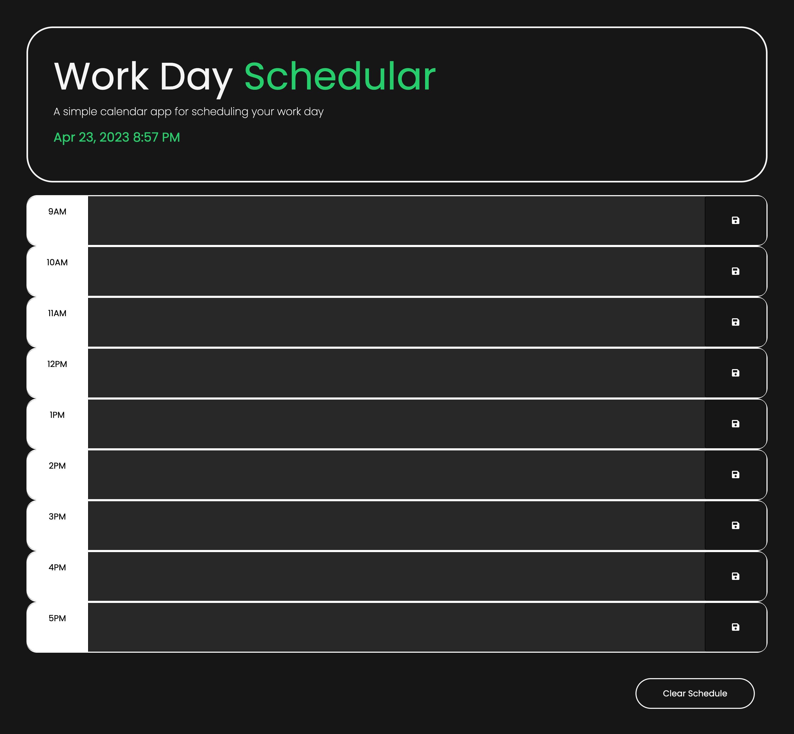

# ml-dailyscheduler

<h1>Module 5: Schedule Challenge</h1>

Link to project here:

https://mlukicdesign.github.io/ml-dailyscheduler/

Screenshot of the project below:

This project utilises Jquery and the Day.js api to create a simple calendar application to schedule your work day. 

Each 'time-block' has an associated id that allows a conditional statement to apply the corresponding styling for past, present and future blocks. This allows the UI to display colour coded blocks. The conditional statement compares the number of the id and the current time. For example, 2pm = number 14. 

Each save button has an event listen to store the users input data in the local storage. This way it can be accessed even if the browser is closed. Another button has been included to clear the data if a new day has begun. 

Some custom styling has been added for my own personal taste!